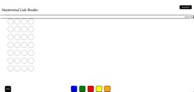

  

A deduction game where each player takes turn making a limited number of guesses, using logic to deduce what pegs the opponent has hidden. One player secretly puts four colored pegs in the spaces behind a screen at once end of the game board. The other player, the code breaker, makes a series of guesses. Only in this game, you are going up against a computer.
