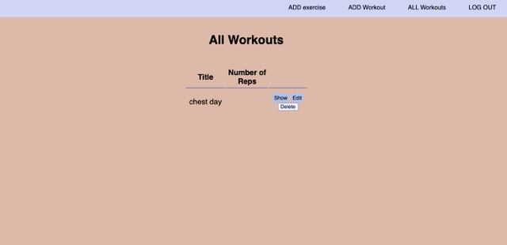

Routine is a personalized workout Routine tracker. It helps you track the weight, reps, and exercise you are doing each day in the gym. This app was my second app ever built and I wanted something that would help me with one of my hobbies, working out. I am happy with how it turned out and am constantly updating my applications to satisfy the user.
