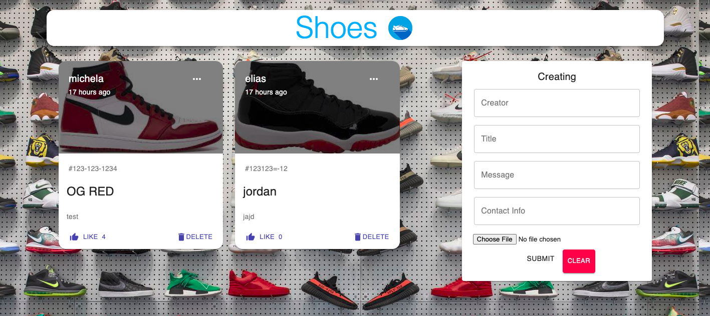

  

 This app is designed for shoe enthusiasts to showcase their shoe collection, connect with other shoe lovers, and even buy, sell, or trade shoes. Users can easily upload photos of their shoes, add descriptions and hashtags, and edit or delete their posts as needed. Other users can show their appreciation for a particular pair of shoes by liking the post. With the added feature of a secure marketplace, users can conveniently buy, sell, or trade shoes within the app. Whether you're looking to expand your collection or make some extra cash, this app has everything you need to satisfy your shoe obsession.

 [link to Heroku deployment](https://shoes-project4.netlify.app/)
