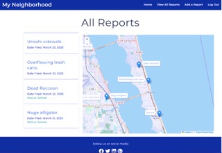

The application we have developed provides a platform for community users to report any issue or concern they have to the community and contact the appropriate authorities to handle the situation. Our user-friendly interface allows for seamless editing of reports and updating of status on events, as well as commenting on reports within their area. Users are also able to upload pictures to their reports and delete them as needed. In the event that a user does not know the exact address of the incident, they can easily locate it on our map interface. Our application is designed to ensure the safety and security of a community or city by empowering citizens to take an active role in identifying and reporting issues. By providing a simple and accessible way to report concerns, we hope to make our community a safer place for all.

 

